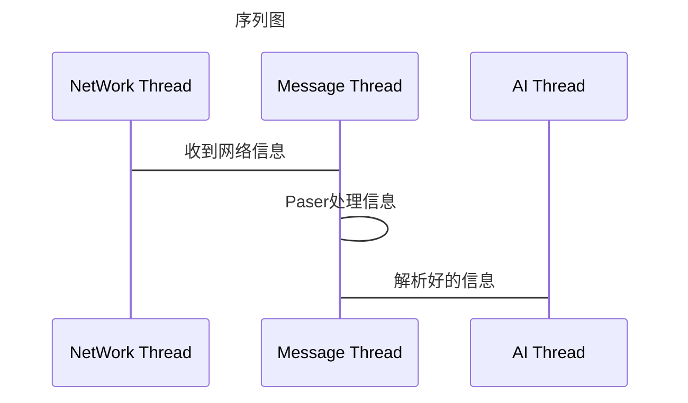
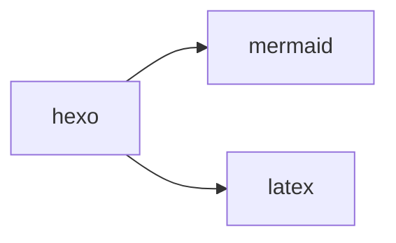

### Android 15 selinux 编译

Android 15 selinux 编译 和之前不一样了,之前可以
```shell
        mmm system/sepolicy
```
现在这个用不了了,

需要m 单独编译
```makefile
   make selinux_policy -j32
```





graph LR
    A[开始] --> B[中间步骤]
    B --> C[结束]


